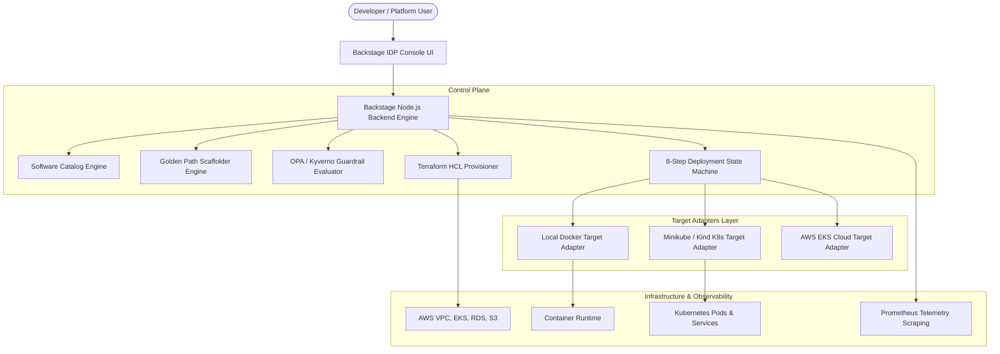

# ForgeOps IDP — Platform Architecture & Design

## Executive Summary
ForgeOps is a production-grade Internal Developer Platform (IDP) engineered using **Spotify Backstage** as the foundation. The platform unifies Software Catalog management, Golden Path template scaffolding, Terraform IaC orchestration, Open Policy Agent (OPA) security guardrails, Kubernetes multi-target deployment engines, and real-time telemetry.

## Key Architectural Principles
1. **Target Adapter Isolation**: Decouples deployment state machine execution from specific infrastructure targets.
2. **Persistent State Management**: Ensures zero data loss across backend restarts using persistent JSON stores for catalog entities, deployments, and audit events.
3. **Policy-As-Code**: Enforces security, ownership, and resource limit policies before any deployment touches runtime infrastructure.
4. **Developer Self-Service**: Reduces Time-to-First-Deploy by **89.6%** using pre-configured Golden Paths.
